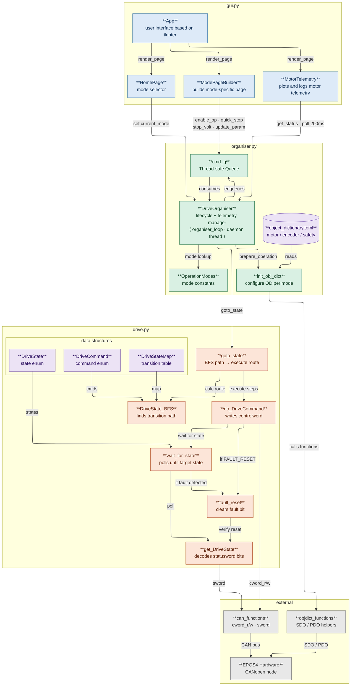

```mermaid
flowchart-elk

    %% ─── GUI LAYER ───────────────────────────────────────────
    subgraph GUI["gui.py"]
        App["**App**<br/>user interface based on tkinter"]
        HomePage["**HomePage**<br/>mode selector"]
        ModePageBuilder["**ModePageBuilder**<br/>builds mode-specific page"]
        MotorTelemetry["**MotorTelemetry**<br/>plots and logs motor telemetry"]

        App -->|render_page| HomePage
        App -->|render_page| ModePageBuilder
        App -->|render_page| MotorTelemetry
    end

    %% ─── ORGANISER LAYER ─────────────────────────────────────
    subgraph ORG["organiser.py"]
        DriveOrganiser["**DriveOrganiser**<br/>lifecycle + telemetry manager<br/>⟨ organiser_loop · daemon thread ⟩"]
        cmd_q["**cmd_q**<br/>Thread-safe Queue"]
        OperationModes["**OperationModes**<br/>mode constants"]
        init_obj_dict["**init_obj_dict**<br/>configure OD per mode"]
        ObjDictToml[("**object_dictionary.toml**<br/>motor / encoder / safety")]

        DriveOrganiser -->|enqueues| cmd_q
        cmd_q -->|consumes| DriveOrganiser
        DriveOrganiser -->|mode lookup| OperationModes
        DriveOrganiser -->|prepare_operation| init_obj_dict
        ObjDictToml -->|reads| init_obj_dict
    end

    %% ─── DRIVE LAYER ─────────────────────────────────────────
    subgraph DRV["drive.py"]
        goto_state["**goto_state**<br/>BFS path → execute route"]

        DriveState_BFS["**DriveState_BFS**<br/>finds transition path"]
        do_DriveCommand["**do_DriveCommand**<br/>writes controlword"]

        wait_for_state["**wait_for_state**<br/>polls until target state"]
        fault_reset["**fault_reset**<br/>clears fault bit"]

        get_DriveState["**get_DriveState**<br/>decodes statusword bits"]

        subgraph DATA["data structures"]
            DriveCommand["**DriveCommand**<br/>command enum"]
            DriveStateMap["**DriveStateMap**<br/>transition table"]
            DriveState_enum["**DriveState**<br/>state enum"]
        end

        goto_state -->|calc route| DriveState_BFS
        goto_state -->|execute steps| do_DriveCommand

        DriveCommand -->|cmds| DriveState_BFS
        DriveStateMap -->|map| DriveState_BFS
        DriveState_enum -->|states| wait_for_state

        do_DriveCommand -->|wait for state| wait_for_state
        do_DriveCommand -->|if FAULT_RESET| fault_reset
        wait_for_state -->|if fault detected| fault_reset

        wait_for_state -->|poll| get_DriveState
        fault_reset -->|verify reset| get_DriveState
    end

    %% ─── EXTERNAL ────────────────────────────────────────────
    subgraph EXT["external"]
        can_functions["**can_functions**<br/>cword_r/w · sword"]
        objdict_functions["**objdict_functions**<br/>SDO / PDO helpers"]
        EPOS4["**EPOS4 Hardware**<br/>CANopen node"]

        can_functions -->|CAN bus| EPOS4
        objdict_functions -->|SDO / PDO| EPOS4
    end

    %% ─── CROSS-LAYER CONNECTIONS ─────────────────────────────
    HomePage        -->|set current_mode| DriveOrganiser
    ModePageBuilder -->|"enable_op · quick_stop<br/>stop_volt · update_param"| cmd_q
    MotorTelemetry  -->|get_status · poll 200ms| DriveOrganiser

    DriveOrganiser  -->|goto_state| goto_state

    get_DriveState  -->|sword| can_functions
    do_DriveCommand -->|cword_r/w| can_functions
    init_obj_dict   -->|calls functions| objdict_functions

    %% ─── STYLES ──────────────────────────────────────────────
    classDef gui  fill:#ddeaf8,stroke:#2e6da4,color:#17355a
    classDef org  fill:#d9f0e3,stroke:#27774a,color:#133d24
    classDef drv  fill:#fce5d8,stroke:#b04a22,color:#5a1e05
    classDef ext  fill:#e8e8e8,stroke:#777777,color:#333333
    classDef data fill:#ece3f5,stroke:#6e4aaa,color:#2d1060

    class App,HomePage,ModePageBuilder,MotorTelemetry gui
    class DriveOrganiser,cmd_q,OperationModes,init_obj_dict org
    class ObjDictToml data
    class goto_state,DriveState_BFS,do_DriveCommand,wait_for_state,fault_reset,get_DriveState drv
    class DriveCommand,DriveStateMap,DriveState_enum data
    class can_functions,objdict_functions,EPOS4 ext
```